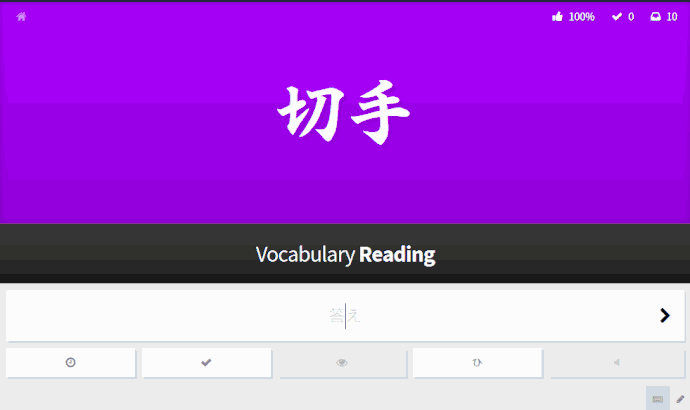

   
  The font randomizer that fits

**Jitai** (字体) is a userscript for [WaniKani](https://wanikani.com).  
It sets the font of the radical/kanji/vocabulary automatically  to a random Japanese font.
> [@obskyr](https://community.wanikani.com/t/jitai-字体-the-font-randomizer-that-fits/12617#jitai-logouploadskfps3jv5ojuckdedpacfc4qn4ppng-what-is-jitai-1): One thing that can become a bit of a problem when using WaniKani is that you are only ever exposed to one font. What this means is that if you ever run into a kanji in the wild, even if you know it, you might not recognize it. Especially with handwriting and calligraphy and all that jazz being around, it helps a lot to get in a bit of training on fonts that aren’t Meiryo.

Questions? Visit the [forum][forum].

## Features

- Supports fonts installed on your machine[^1]
- **(NEW)** Supports fonts from GoogleFonts
- Hover over a font to change it back to normal font (useful if you cannot read it sometimes)

## Installation

First make sure you have a userscript manager like **Tampermonkey** installed.  
Then click on the link below, and your userscript manager should directly recognize it as a userscript to install:  
<a href="https://github.com/marciska/Jitai/raw/main/Jitai.users.js" style="font-size: 30px;"> Download</a>

## Note

Jitai has been created by [@obskyr][obskyr] and was given an MIT licence for free use, publication and modification.
Sadly, the script hasn't been updated since 2018 on the official sources. The original script broke functionality on some browsers as major browser developers removed support for installed fonts in an attempt to prevent [Font Fingerprinting](https://browserleaks.com/fonts).

Jitai has been made available here on GitHub to allow others contribute bug fixes and other improvements.
These changes include so far:

- bug-fix: shifting dependence to fonts on Google Fonts, rather than relying on fonts installed on your machine
- more fonts
- making it easier to enable/disable fonts *during review*, rather than being forced to edit the script

If you like this project, please support other projects from [@obskyr][obskyr] or by visiting the [forum][forum].

<!-- Footnotes -->
[^1]: Browsers that support this feature are running out. [See more](https://community.wanikani.com/t/jitai-%E5%AD%97%E4%BD%93-the-font-randomizer-that-fits/12617/644).

<!-- Links -->
[obskyr]:https://github.com/obskyr
[forum]:https://community.wanikani.com/t/jitai-字体-the-font-randomizer-that-fits/12617
